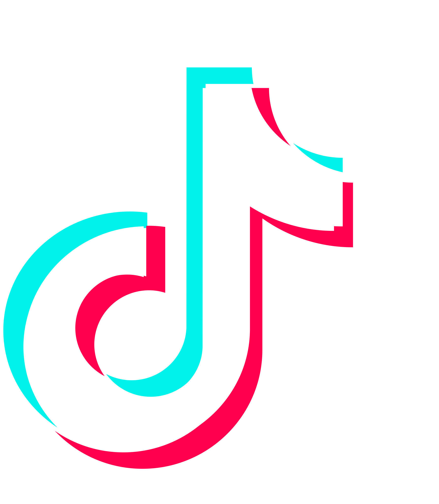

<h1 align="center">👋 Hi, I'm mzkyzak</h1>

  <strong>RPL Student</strong> • <strong>Gamer</strong>

  

---
## 👨🏻‍💻 Programming Languages & Tools

| HTML | CSS | JavaScript | PHP | Dart | Java |
| :---: | :---: | :---: | :---: | :---: | :---: |
|  |  |  |  |  |  |

 

| MySQL | Android Studio | React | VS Code | Flutter | Sketchware |
| :---: | :---: | :---: | :---: | :---: | :---: |
|  |  |  |  |  |  |

---

### 🎨 Design Graphic Tools

| Figma | Unity | Canva | Lightroom | CapCut |
| :---: | :---: | :---: | :---: | :---: |
|  |  |  |  |  |

---

### 🖥️ Operating Systems

| Windows | Android | Ubuntu | Linux |
| :---: | :---: | :---: | :---: |
|  |  |  |  |

---

## 🌐 Social Media

| LinkedIn | WhatsApp | Instagram | TikTok | YouTube |
| :---: | :---: | :---: | :---: | :---: |
|  |  |  |  |  |

---

<h2 align="center">📊 GitHub Statistics</h2>

  <table>
    <tr>
      <td>
        
      </td>
      <td>
        
      </td>
    </tr>
  </table>

 

---

<!-- STREAK -->
<h2 align="center">🔥 Contribution Streak</h2>

  

 

---

<!-- ACTIVITY GRAPH -->
<h2 align="center">📈 Activity Graph</h2>

  

---

<h2 align="center">🏅 Achievements</h2>

  
  
  

 

## 🚀 About Me
 - 🎓 Student (RPL)
 - 🧑‍💻 website Android games
 - 🎮 Progammer
