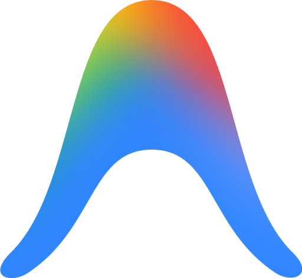

<h1 align="center">
  
</h1>

  <strong>🔐 Buatt virus gas </strong> • <strong>💀 Cyber Security</strong> • <strong>🔥 Cyber Jahat</strong> • <strong>⚡ Mobile Exploit</strong>

  
  
  

---

## 👨🏻‍💻 Programming Languages & Tools (AI)

| HTML | CSS | Tailwind | JavaScript | PHP | Dart | XML | Python |
| :---: | :---: | :---: | :---: | :---: | :---: | :---: | :---: |
|  |  |  |  |  |  |  |  |

| Java | C# | Next.js | Three.js | GSAP | Fiber.js | Kotlin | Bash (sh) |
| :---: | :---: | :---: | :---: | :---: | :---: | :---: | :---: |
|  |  |  |  |  |  |  |  |

 

| MySQL | Laravel | React | Flutter | Git | Google AI Studio |
| :---: | :---: | :---: | :---: | :---: | :---: |
|  |  |  |  |  |  |

| VS Code | Cursor IDE | Android Studio | Sketchware | Antigravity | Kiro |
| :---: | :---: | :---: | :---: | :---: | :---: |
|  |  |  |  |  |  |

### 🎨 Design Graphic Tools

| Figma | Unity | Canva | Lightroom |
| :---: | :---: | :---: | :---: |
|  |  |  |  |

| CapCut | Google Stitch | Blender | After Effects |
| :---: | :---: | :---: | :---: |
|  |  |  |  |

---

### 🖥️ Operating Systems

| Windows | Android | Ubuntu | Linux |
| :---: | :---: | :---: | :---: |
|  |  |  |  |

---

## 🌐 Social Media

| LinkedIn | WhatsApp | Instagram | TikTok | YouTube |
| :---: | :---: | :---: | :---: | :---: |
|  |  |  |  |  |

---

## 📊 **GitHub Statistics**

  <table>
    <tr>
      <td>
        
      </td>
      <td>
        
      </td>
    </tr>
  </table>

 

---

## 🔥 **Contribution Streak**

  

 

---

## 📈 **Activity Graph**

  

---

## 🏅 **Achievements**

  
  
  
  
  

---

## 💀 **About Me**

- 🎓 **Student (RPL)** — *Belajar Cyber Security & Exploit*  
- 💀 **Ransomware Developer** — *Fokus di Mobile Ransomware*  
- 🔐 **Cyber Security** — *Ethical Hacking & Penetration Testing*  
- 🧠 **Reverse Engineering** — *Android APK Decompiler & Modder*  
- 📱 **Mobile Exploit** — *Flutter, Kotlin, Java, XML*  
- 🎮 **Gamer & Hacker** — *Break everything, learn everything*  

---

  

  
  

